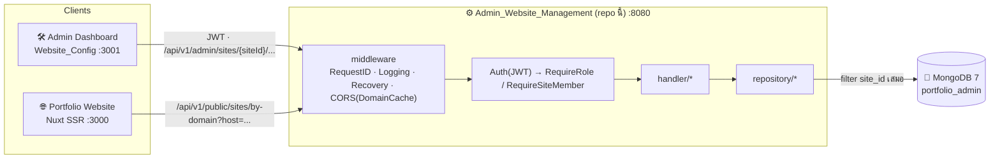
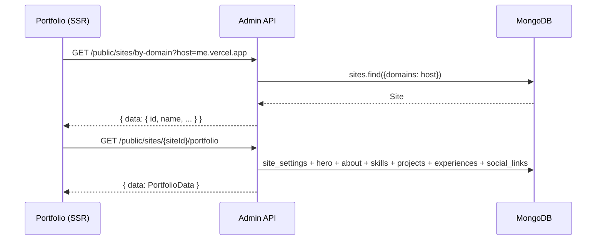

<div align="center">

# Portfolio Admin API

**Backend REST API ของระบบ Multi-Site Portfolio — Go + MongoDB, แยกข้อมูลทุกเว็บด้วย `site_id`**

One API, many portfolio websites.

[](https://go.dev)
[](https://pkg.go.dev/net/http)
[](https://www.mongodb.com)
[](https://github.com/golang-jwt/jwt)
[](https://docs.docker.com/compose/)
[](https://render.com)

[ฟีเจอร์](#-ฟีเจอร์) ·
[เริ่มต้นใช้งาน](#-เริ่มต้นใช้งาน) ·
[สถาปัตยกรรม](#-สถาปัตยกรรม) ·
[API](#-api-reference) ·
[โครงสร้างโปรเจกต์](#-โครงสร้างโปรเจกต์) ·
[เอกสาร](#-เอกสารเพิ่มเติม)

</div>

---

## 🧩 ระบบนี้ประกอบด้วยอะไร

Repo นี้เป็น **1 ใน 3 ส่วน** ของระบบ Multi-Site Portfolio ทั้ง 3 repo ต่อกันด้วย REST API และ contract `site_id`

| Repo | หน้าที่ | Stack | Port dev |
|---|---|---|---|
| **Admin_Website_Management** (repo นี้) | Backend REST API + MongoDB | Go 1.22 · MongoDB 7 · JWT | 8080 |
| [Admin_Websie_Config](https://github.com/RujikornTonkaow/Admin_Websie_Config) | Admin dashboard จัดการ sites / users / content | Nuxt 3 (SPA) · Tailwind · i18n | 3001 |
| [Portfolio](https://github.com/RujikornTonkaow/Portfolio) | เว็บ portfolio หน้าบ้าน แสดงเนื้อหาตาม domain | Nuxt 3 (SSR) · Tailwind · Three.js | 3000 |

---

## ✨ ฟีเจอร์

| | ฟีเจอร์ | รายละเอียด |
|---|---|---|
| 🌐 | **Multi-site** | database เดียวเก็บได้หลายเว็บ ทุก document ของเนื้อหามี `site_id`; map domain → site ผ่าน `sites.domains` |
| 🔓 | **Public API** | เว็บ Portfolio หา `siteId` จาก hostname แล้วดึงเนื้อหาทั้ง site ใน 1 request, รับข้อความจาก contact form, serve รูปที่ upload |
| 🛠️ | **Admin API** | CRUD users, sites, สมาชิกของ site และเนื้อหา portfolio ทุก section (site settings, hero, about, skills, projects, experiences, social links, contacts, upload) |
| 🔐 | **JWT + RBAC** | login ด้วย username/password → JWT HS256; role เป็น global (`super_admin` > `admin` > `editor` > `viewer`) ตรวจ membership ต่อ site เพิ่มจาก `site_members` |
| 🌱 | **Auto seed** | database ว่าง → สร้าง user `super_admin`, site default ที่ผูกกับ `localhost:3000`, membership และเนื้อหาตัวอย่างอัตโนมัติ |
| 🔄 | **CORS อัตโนมัติ** | อนุญาต origin จาก `ALLOWED_ORIGINS` + ทุก domain ใน `sites.domains` ผ่าน `DomainCache` ที่ refresh ทุก 5 นาที |
| 🖼️ | **Upload รูป** | multipart upload ตรวจขนาด/ชนิดไฟล์ บันทึกด้วยชื่อ uuid คืน path `/uploads/xxx.jpg` |
| 📦 | **Zero framework** | ใช้ `net/http` ServeMux ของ Go 1.22 (method-based routing + path params) ไม่มี Gin/Echo/Chi |
| 🐳 | **Docker ready** | multi-stage build, non-root user, HEALTHCHECK, Docker Compose พร้อม MongoDB 7 |

---

## 🚀 เริ่มต้นใช้งาน

### สิ่งที่ต้องมี

- [Docker](https://www.docker.com) + Docker Compose (แนะนำ) **หรือ**
- Go 1.22 ขึ้นไป + MongoDB 7 ที่รันอยู่แล้ว

### ติดตั้งและรัน

```bash
# 1. Clone
git clone https://github.com/RujikornTonkaow/ADMIN_API_CONFIG.git
cd ADMIN_API_CONFIG

# 2. ตั้งค่า environment variables
cp .env.example .env
# เปิด .env แล้วเปลี่ยน JWT_SECRET / ADMIN_PASSWORD ตามต้องการ

# 3a. รันด้วย Docker (ได้ทั้ง API + MongoDB)
docker compose up --build -d
docker compose logs -f api

# 3b. หรือรัน local (ต้องมี MongoDB รันอยู่ที่ MONGO_URI)
go mod tidy
go run ./cmd/server
```

API พร้อมใช้งานที่ `http://localhost:8080`

### ทดสอบว่าทำงาน

```bash
# resolve site จาก host (seed ผูก localhost:3000 ไว้ให้แล้ว)
curl "http://localhost:8080/api/v1/public/sites/by-domain?host=localhost:3000"

# login ด้วย user seed
curl -X POST http://localhost:8080/api/v1/admin/auth/login \
  -H "Content-Type: application/json" \
  -d '{"username":"admin","password":"changeme123"}'
```

> 💡 **Login เริ่มต้น** คือ `admin` / `changeme123` (จาก `ADMIN_USERNAME` / `ADMIN_PASSWORD`) — เปลี่ยนก่อนขึ้น production

### Environment Variables

| ตัวแปร | default | คำอธิบาย |
|---|---|---|
| `PORT` | `8080` | port ของ API |
| `MONGO_URI` | `mongodb://localhost:27017` (compose: `mongodb://mongo:27017`) | MongoDB connection string |
| `MONGO_DB` | `portfolio_admin` | ชื่อ database |
| `JWT_SECRET` | `change-me-in-production` | secret สำหรับ sign JWT — **ต้องเปลี่ยน** ใน production |
| `ADMIN_USERNAME` / `ADMIN_PASSWORD` | `admin` / `changeme123` | user seed ครั้งแรก (role `super_admin`) |
| `UPLOAD_DIR` | `./uploads` | โฟลเดอร์เก็บไฟล์ upload |
| `MAX_UPLOAD_SIZE_MB` | `10` | ขนาดไฟล์สูงสุด |
| `ALLOWED_ORIGINS` | `http://localhost:3000` | static origins (เช่น admin dashboard `http://localhost:3001`); domain ของ portfolio โหลดจาก DB อัตโนมัติ |
| `RESET_DATABASE_ON_START` | `false` | `true` = drop DB แล้ว seed ใหม่ทุกครั้งที่ start (ใช้เฉพาะ dev) |

### คำสั่งที่ใช้บ่อย

| คำสั่ง | ทำอะไร |
|---|---|
| `go run ./cmd/server` | รัน API แบบ local |
| `go build ./... && go vet ./...` | build + ตรวจโค้ดก่อน commit |
| `CGO_ENABLED=0 go build -o server ./cmd/server` | build static binary |
| `docker compose up --build -d` | รัน API + MongoDB ด้วย Docker |
| `docker compose down -v` | หยุดและลบ volume (ล้าง DB + uploads) |

---

## 🏗️ สถาปัตยกรรม



### Request lifecycle

```
Request
 └─ Chain(RequestID → Logging → Recovery → CORS)          [global middleware]
     └─ ServeMux match "METHOD /path/{param}"
         └─ (admin routes) Auth(JWT) → RequireRole / RequireSiteMember
             └─ handler.X()  → response.DecodeJSON(body)   (DisallowUnknownFields)
                 └─ repository.X() → MongoDB (filter ด้วย site_id เสมอ)
                     └─ { "data": ... }  หรือ  { "error": "..." }
```

### Flow ฝั่ง Public (เว็บ Portfolio เรียก)



### Tech stack

| ส่วน | เทคโนโลยี |
|---|---|
| ภาษา / Runtime | Go 1.22 (module `portfolio-admin-api`) |
| HTTP router | `net/http` ServeMux (Go 1.22 method routing + `r.PathValue`) — ไม่ใช้ framework |
| Database | MongoDB 7 · `go.mongodb.org/mongo-driver` v1.17 |
| Auth | JWT HS256 (`github.com/golang-jwt/jwt/v5`) · bcrypt (`golang.org/x/crypto`) |
| Logging | `log/slog` structured JSON + request id |
| Container | Docker multi-stage (`golang:1.22-alpine` → `alpine:3.19`) + Docker Compose |
| Pattern | Layered: `router → middleware → handler → repository → MongoDB` |
| Hosting (prod) | Render + MongoDB Atlas |

### Roles

| Role | ระดับ | สิทธิ์ |
|---|---|---|
| `super_admin` | 4 | เห็นทุก site (ไม่ต้องมี membership), สร้าง/ลบ site, จัดการทุก user, สร้าง `super_admin` ได้ |
| `admin` | 3 | จัดการ users และ content เฉพาะ site ที่อยู่ใน `site_members` |
| `editor` | 2 | แก้ content เฉพาะ site ที่อยู่ใน `site_members` |
| `viewer` | 1 | อ่าน dashboard/contacts เฉพาะ site ที่อยู่ใน `site_members` |

`site_members` เป็น **access list** (มี/ไม่มีสิทธิ์เข้า site) ไม่ใช่ per-site role — role จริงมาจาก JWT เสมอ

### Data model (MongoDB)

```
admin_users ──┐
              ├── site_members (user_id + site_id)   ← ใครเข้า site ไหนได้
sites ────────┘
  │  site_id อยู่ในทุก document ด้านล่าง
  ├── site_settings   (1 ต่อ site)   site_title, meta, footer, default_theme, profile_image
  ├── hero            (1 ต่อ site)   greeting, full_name, subtitle, CTA
  ├── about           (1 ต่อ site)   bio_paragraphs[], personality_tags[], stats[]
  ├── skills          (n)            name, icon (Iconify), category, sort_order
  ├── projects        (n)            title, tags[], image, live_url, source_url
  ├── experiences     (n)            role, company, period, highlights[]
  ├── social_links    (n)            name, url, icon
  └── contact_messages(n)            name, email, message, is_read
```

Schema เต็มพร้อมตัวอย่าง document อยู่ใน [`GUIDE/05-DATABASE-SCHEMA.md`](./GUIDE/05-DATABASE-SCHEMA.md)

---

## 📡 API Reference

Response ทุกตัว: สำเร็จ `{ "data": ..., "meta"?: ... }` / ผิดพลาด `{ "error": "message" }`

### Public (ไม่ต้อง auth)

| Method | Path | ใช้ทำอะไร |
|---|---|---|
| `GET` | `/api/v1/public/sites/by-domain?host=:host` | resolve site จาก hostname |
| `GET` | `/api/v1/public/sites/{siteId}/portfolio` | เนื้อหาทั้ง site ใน 1 response |
| `POST` | `/api/v1/public/sites/{siteId}/portfolio/contacts` | ส่งข้อความ contact |
| `GET` | `/uploads/{filename}` | รูปที่ upload |

### Admin (ต้องมี `Authorization: Bearer <jwt>`)

| กลุ่ม | Path | Guard |
|---|---|---|
| Auth | `POST /api/v1/admin/auth/login` · `GET .../auth/me` | – / viewer+ |
| Users | `GET/POST /api/v1/admin/users` · `GET/PUT/DELETE /{id}` · `PUT /{id}/password` · `GET/PUT /{id}/memberships` | admin+ |
| Sites | `GET /api/v1/admin/sites` · `POST` · `GET/PUT/DELETE /{siteId}` | viewer+ · super_admin · site viewer/admin |
| Site members | `GET/POST /{siteId}/members` · `PUT/DELETE /{siteId}/members/{memberId}` | site admin |
| Singleton content | `GET/PUT /{siteId}/portfolio/{site-settings,hero,about}` | site editor |
| List content | `GET/POST /{siteId}/portfolio/{skills,projects,experiences,social-links}` · `PUT/DELETE .../{id}` | site editor |
| Reorder | `PUT /{siteId}/portfolio/{projects,experiences,social-links}/reorder` | site editor |
| Contacts | `GET /{siteId}/portfolio/contacts` · `GET/DELETE .../{id}` | site viewer / editor (delete) |
| Upload | `POST /{siteId}/portfolio/upload` (multipart) | site editor |

> ⚠️ Legacy routes แบบไม่มี `{siteId}` ถูกถอดออกแล้ว ทุก route ของเนื้อหาเป็น site-scoped เท่านั้น

Payload ทุก endpoint อยู่ใน [`GUIDE/04-API-REFERENCE.md`](./GUIDE/04-API-REFERENCE.md)

---

## 📂 โครงสร้างโปรเจกต์

```
Admin_Website_Management/
├── cmd/server/main.go              # entry point: config → Mongo → seed → DomainCache → router → graceful shutdown
├── internal/
│   ├── config/config.go            # อ่าน env → struct Config
│   ├── database/
│   │   ├── mongodb.go              # Connect() + ping
│   │   └── seed.go                 # SeedIfEmpty / SeedPortfolioContent
│   ├── handler/                    # HTTP handlers (1 ไฟล์ต่อ resource): public, auth, user, site, site_member,
│   │                               #   site_settings, hero, about, skill, project, experience, social_link, contact, upload
│   ├── middleware/middleware.go    # RequestID, Logging, Recovery, CORS + DomainCache, Auth, RequireRole, RequireSiteMember
│   ├── model/model.go              # struct ทุก collection + DTO + role constants
│   ├── repository/                 # Mongo CRUD (1 ไฟล์ต่อ collection) — ทุก query filter site_id
│   └── router/router.go            # ประกาศ route ทั้งหมด + ผูก guard
├── pkg/response/json.go            # JSON envelope helpers (DecodeJSON ใช้ DisallowUnknownFields)
├── uploads/                        # ไฟล์รูปที่ upload (Docker volume)
├── GUIDE/                          # เอกสารเชิงลึก 01..06
├── Dockerfile
├── docker-compose.yml
└── .env.example
```

### กติกาก่อนแก้โค้ด

- **เพิ่ม resource ใหม่** แก้ 5 จุดตามลำดับ: `model.go` → `repository/x.go` → `handler/x.go` → `router.go` → `main.go`
- **ทุก query ของเนื้อหาต้อง filter `site_id`** ห้าม query แบบ global
- **Content routes ต้องใช้ `RequireSiteMember`** ไม่ใช่ `RequireRole` อย่างเดียว
- **`sites.domains` เก็บเฉพาะ host** เช่น `localhost:3000`, `me.vercel.app` ห้ามมี `https://` หรือ `/`
- **เปลี่ยน API contract** ต้องแก้ให้ครบทั้ง 3 ฝั่ง: `model.go` → `Website_Config/types/*.ts` → `Portfolio/types/portfolio.ts`
- หลังแก้เสร็จรัน `go build ./... && go vet ./...`

---

## ☁️ Deploy

Production ปัจจุบันรันบน **Render** (`admin-api-config.onrender.com`) ใช้ MongoDB Atlas

1. สร้าง Web Service บน [render.com](https://render.com) จาก repo นี้ (Docker runtime — Render อ่าน `Dockerfile` เอง)
2. ตั้ง Environment Variables ทุกตัวตามตารางด้านบน โดยเฉพาะ `MONGO_URI` (Atlas), `JWT_SECRET`, `ALLOWED_ORIGINS` (origin ของ admin dashboard)
3. หลัง deploy ให้เพิ่ม domain ของเว็บ Portfolio (เช่น `xxx.vercel.app`) ใน `sites.domains` ผ่าน admin dashboard — CORS จะอนุญาตเองภายใน 5 นาที

> **หมายเหตุ:** Docker HEALTHCHECK ยิงไปที่ `by-domain?host=localhost:3000` ถ้าลบ site default ใน production container จะถูกมองว่า unhealthy

รายละเอียดอยู่ใน [`GUIDE/06-SETUP-AND-DEPLOYMENT.md`](./GUIDE/06-SETUP-AND-DEPLOYMENT.md)

---

## 📚 เอกสารเพิ่มเติม

| ไฟล์ | เนื้อหา |
|---|---|
| [`GUIDE/01-SYSTEM-FLOW.md`](./GUIDE/01-SYSTEM-FLOW.md) | flow ของ request ตั้งแต่ต้นจนจบ |
| [`GUIDE/02-FILE-REFERENCE.md`](./GUIDE/02-FILE-REFERENCE.md) | อธิบายทุกไฟล์ทีละไฟล์ |
| [`GUIDE/03-TECH-STACK.md`](./GUIDE/03-TECH-STACK.md) | เหตุผลการเลือกเทคโนโลยี |
| [`GUIDE/04-API-REFERENCE.md`](./GUIDE/04-API-REFERENCE.md) | API ทุก endpoint พร้อม request/response |
| [`GUIDE/05-DATABASE-SCHEMA.md`](./GUIDE/05-DATABASE-SCHEMA.md) | schema + index ทุก collection |
| [`GUIDE/06-SETUP-AND-DEPLOYMENT.md`](./GUIDE/06-SETUP-AND-DEPLOYMENT.md) | setup, Docker, deploy |

---

## 👥 ผู้พัฒนา

- [@RujikornTonkaow](https://github.com/RujikornTonkaow)

## 📄 License

โปรเจกต์นี้ยังไม่ได้ระบุ license — เพิ่มไฟล์ `LICENSE` ได้ตามต้องการ (เช่น MIT)

<div align="center">
<sub>Built with Go · MongoDB · ☕</sub>
</div>
